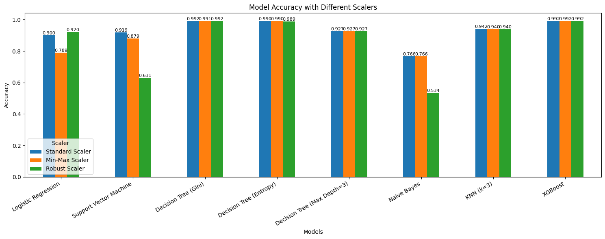

# Fraud Detection

## Overview
This project utilizes machine learning to detect fraudulent transactions effectively. 
The notebook (`fraud_detection.ipynb`) includes data processing, feature engineering, model training, and evaluation.

## Requirements
Install dependencies with:
```sh
pip install -r requirements.txt
```

## Steps to Run
1. Open the Jupyter Notebook:
   ```sh
   jupyter notebook fraud_detection.ipynb
   ```
2. Run the cells to preprocess data, train models, and evaluate performance.

## Key Features
- **Preprocessing:** Cleans and transforms raw transaction data.
- **Feature Engineering:** Enhances predictive power.
- **Modeling:** Uses following algorithms:
    Logistic Regression,
    Support Vector Machine,
    Decision Tree (Gini),
    Decision Tree (Entropy),
    Decision Tree (Max Depth=3),
    Naive Bayes,
    KNN,
    XGBoost
- **Evaluation:** Analyzes model accuracy with the accuracy scores

